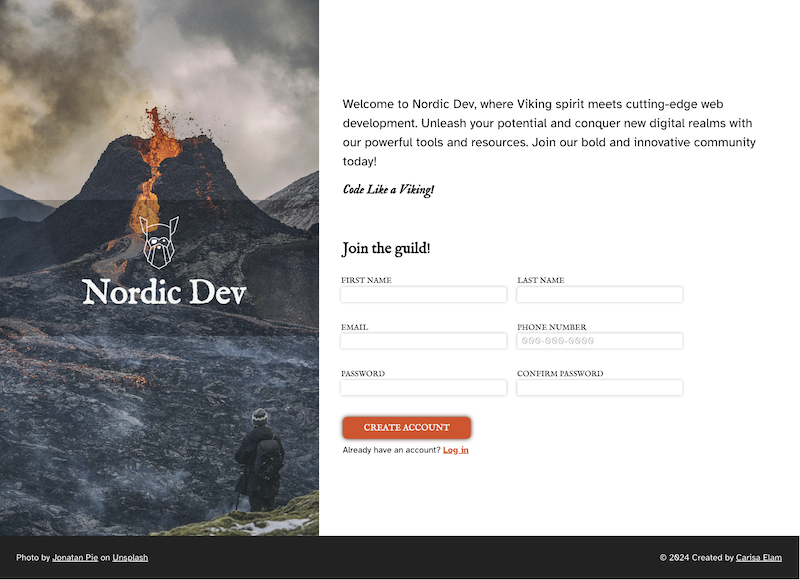

# Odin Sign-Up Form

Welcome to the Odin Sign-Up Form project! This project was part of The Odin Project's Intermediate HTML and CSS curriculum. My goal was to create a functional and visually appealing sign-up form, honing my skills in HTML and CSS. I designed this form to provide users with a seamless and engaging experience as they join the ranks of Nordic Dev. The form included various input fields such as username, email, password, and more, ensuring a comprehensive and user-friendly sign-up process. I followed a mobile first design process.

In this project, I implemented responsive design principles to ensure the form looked great on all devices, from mobile phones to desktops. Additionally, I explored advanced CSS techniques to create a visually appealing layout that aligned with the Nordic Dev brand. By completing this project, I solidified my understanding of form handling, validation, and responsive design, preparing me for more complex web development challenges.

## Acknowledgments

Thank you to Josh Comeau for the [Modern CSS Reset](https://www.joshwcomeau.com/css/custom-css-reset/)

Photo by [Jonathan Pie](https://unsplash.com/@r3dmax?utm_content=creditCopyText&utm_medium=referral&utm_source=unsplash) on [Unsplash](https://unsplash.com/photos/fire-coming-from-mountain-during-daytime-g6tqHx0ME1o?utm_content=creditCopyText&utm_medium=referral&utm_source=unsplash).
